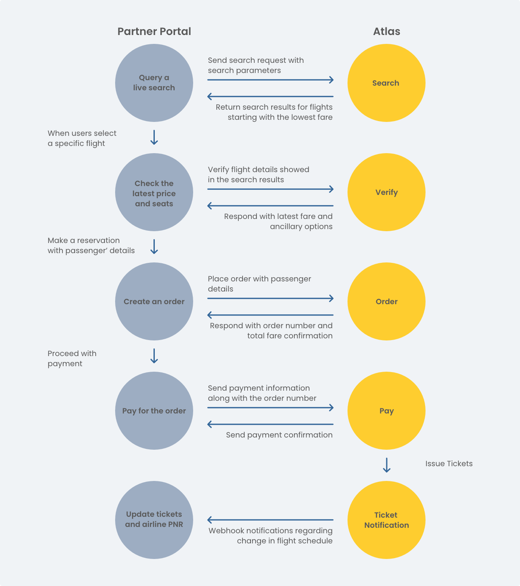

# Booking Overview



Use this section for the end-to-end booking flow.

<figure><figcaption>
Booking flow from search to payment and follow-up
</figcaption></figure>

### Pages in this section

* [Search](search.md)
* [Get Offer](get-offer.md)
* [Verify](verify.md)
* [Create Order](create-order.md)
* [Confirm Order](confirm-order.md)
* [Payment & Ticketing](../../readme/booking-overview/payment-and-ticketing/)
* [Query Order](query-order.md)
* [Seats & Baggage](seats-and-baggage.md)

### What this section covers

* Search for flight offers
* Retrieve offers through an independent Get Offer flow
* Verify fares and routing
* Create orders
* Confirm FR orders
* Pay and issue tickets
* Retrieve booking details
* Run advanced search flows
* Query seats and luggage

### Typical flow



### Standard search path

Search for available offers and keep the returned identifiers.



### Verify

Recheck fare, routing, and booking requirements before order creation.



### Order

Create the booking with passenger, contact, and ancillary details.



### Pay

Complete payment and wait for ticketing to finish.



### Alternate flow

Use this path when you already know the target itinerary or need an independent price check.



### Get Offer

Call `getOffers.do` and keep the returned `OfferId`.



### Optional ancillaries

Query `getLuggage.do` or `seatAvailability.do` only when baggage or seat choice matters before booking.



### Order

Create the booking with `order.do`.



### Pay

Complete payment with `pay.do`.



### Main APIs

* `search.do`
* `getOffers.do`
* `verify.do`
* `order.do`
* `orderCommit.do`
* `pay.do`
* `queryOrderDetails.do`
* `smartSearch.do`
* `seatAvailability.do`
* `getLuggage.do`

### Use this when you need

* A standard search-to-ticket flow
* An independent offer lookup and price-check flow
* FR order confirmation support
* Seat and baggage selection
* Real-time or smart search options

### Full API reference

Use endpoint-level details here:

[Booking APIs](../../api-reference/booking-apis/)

### Related pages

* [Quick Start](../quick-start/)
* [Get Sandbox Credentials](../quick-start/making-requests.md)
* [Error Codes](../../troubleshooting-and-support/errors-handing/)
