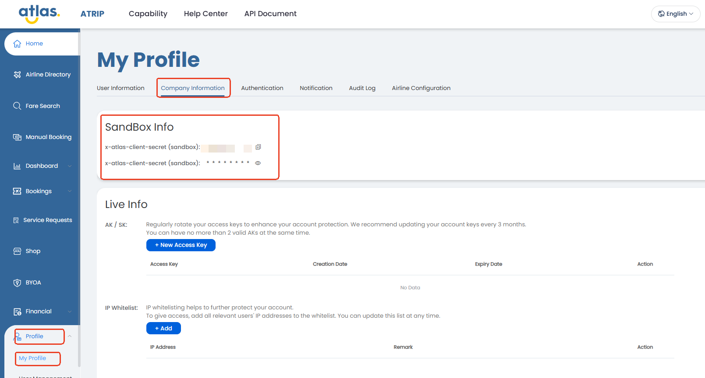

# Sandbox Access

Use this page to get sandbox access and prepare your first API calls.

### Goal of this phase

Complete the initial access setup for sandbox.

You should finish this phase before building the booking flow.

### Generate sandbox credentials

Get your sandbox credentials in ATRIP:

1. Open `Profile`.
2. Open `My Profile`.
3. Open `Company Information`.

<figure><figcaption></figcaption></figure>

In `Sandbox Info`, you can find:

* `x-atlas-client-id`
* `x-atlas-client-secret`

Use these values on every sandbox API call.

### Standard headers

Send these headers by default:

* `Content-Type: application/json`
* `Accept: application/json`
* `Accept-Encoding: gzip`
* `x-atlas-client-id: <your-client-id>`
* `x-atlas-client-secret: <your-client-secret>`

### Request basics

Use these request defaults:

```
POST /<endpoint>.do
```

* Use `POST` for Atlas API calls.
* Send a JSON body on every call.

### Identifiers used later

You will capture these identifiers in later steps.

Reuse them across the booking flow:

* `routingIdentifier`
* `sessionId`
* `orderNo`

### Response and compression basics

Atlas responses can be large.

If you send `Accept-Encoding: gzip`, handle gzip responses correctly.

Most HTTP clients decompress gzip automatically.

Use these rules in every integration:

* Treat `status == 0` as success.
* Do not use `msg` for business logic.
* Check returned identifiers before moving to the next step.
* Handle compressed responses when `Content-Encoding: gzip` is returned.

### Security basics

Keep both credential values server-side.

Do not expose them in client apps.

Use sandbox for integration and testing.

Use production only after validation is complete.

### Complete this phase when

You can do all of these in sandbox:

* send authenticated requests successfully
* use the standard headers correctly
* know which identifiers are reused later
* handle gzip responses correctly

### Output of this phase

* sandbox client ID and client secret
* working request configuration
* ready-to-start sandbox environment

### Next step

Continue with [Sandbox Development](sandbox-development.md).

### Related pages

* [Quick Start](./)
* [Sandbox Development](sandbox-development.md)
* [Booking Overview](../booking-overview/)
