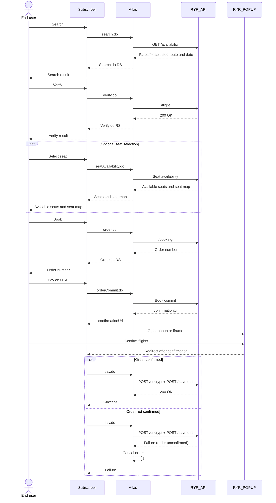

# FR Integration



Use this page when you integrate Ryanair booking flows.

### When to use this flow

Use the FR flow when:

* the airline is FR
* order confirmation is required before final payment
* you need popup or iframe confirmation
* Ryanair-specific display and child seating rules apply

### How FR differs from the standard flow

Compared with the normal booking flow, FR adds extra requirements:

* price transparency for fare and ancillary charges
* explicit passenger consent on the FR confirmation page
* a mandatory `orderCommit.do` step before payment
* special handling for child seating scenarios
* FR-specific UAT and IP allowlisting

### FR workflow diagram

This flow adds an FR confirmation page between `order.do` and `pay.do`.

### FR booking flow



### Search

Call [Search](../booking-overview/search.md) and keep the selected `routingIdentifier`.



### Verify

Call [Verify](../booking-overview/verify.md) and keep the returned `sessionId`.



### Optional seat selection

If you support FR seat selection, call [Seats & Baggage](../booking-overview/seats-and-baggage.md) before booking.

Skip this step if you use the FR child-seat simplification.



### Create the order

Call [Create Order](../booking-overview/create-order.md) with passenger, contact, and required FR fields.

Make sure the order request includes:

* passenger email
* subscriber email
* subscriber company name in `clientContact`
* `locale`



### Collect payment and commit the order

At this stage, the OTA collects payment from the user.\
Do **not** call `pay.do` yet.

Then call [Confirm Order](../booking-overview/confirm-order.md).

Atlas returns `confirmationUrl` for popup mode or iframe mode.



### User confirms on the FR page

Display `confirmationUrl` to the user.

The FR confirmation page contains the required T\&Cs and consent checkbox. The user must complete this step before ticketing.



### Pay and issue

Only after the user completes confirmation, call [Payment & Ticketing](../../readme/booking-overview/payment-and-ticketing/).

Payment can use `VCC` or `Deposit`.



### Poll final status

Use [Query Order](../booking-overview/query-order.md) until `orderStatus=2` and `ticketStatus=0`.



### Confirm Order modes

#### Popup mode

Send the order number and a `redirectUri`.\
Atlas returns `confirmationUrl`.\
Redirect the end user to that page.

Prepare a redirect page URL and share it with Atlas.\
This page should accept `AtlasOrderNumber` as an input parameter.

After the user confirms, FR redirects the user back to your `redirectUri`.

#### Iframe mode

Send the order number with `iframe=true`.\
Atlas returns `confirmationUrl`.\
Display that page inside your iframe flow.

In iframe mode, `redirectUri` is ignored.

### Payment timing rule

Do not call `pay.do` before order confirmation finishes.

If the user does not confirm within 30 minutes after order creation:

* the order status becomes `Expired`
* Atlas will not issue tickets
* the OTA should refund the end user if payment was already collected

If `pay.do` is attempted before the user completes FR confirmation, airline payment can fail and the order can be canceled.

### Required FR business rules

#### Price transparency

Display airline fare separately from:

* airline payment fees
* Atlas service fees
* subscriber markup
* ancillary charges

Read payment-fee data from `cardChargeList` in search and verify responses.

Make sure the user can clearly identify Ryanair's actual price.

#### Passenger consent

The FR confirmation page must collect user consent for:

* terms of service
* privacy policy
* cookie policy
* myRyanair account acknowledgement

#### Contact details

Pass both:

* the passenger email
* the subscriber email and company name in `clientContact`
* the required booking `locale`

This helps ensure both sides receive airline communication.

For supported locale values, see [Locale Reference](../../integration-reference/reference-data/locale.md).

### Child seating rule

FR applies special rules when children under 12 are included.

#### Important behavior

* up to 4 children per adult
* at least one adult may need a paid seat
* children must sit in the same row as the accompanying adult
* seat selection may become mandatory before payment

#### Atlas simplification option

If you are not ready to support full seat selection logic for FR with children:

1. disable seat selection
2. charge the mandatory seating fee
3. let Atlas auto-allocate seats for the first adult and the children

Use `childMandatorySeatingFee` from search and verify responses.

Also ensure that one booking never contains more than 4 children.


If your FR child-seat handling is not ready, block FR child bookings until support is complete.


### UI guidance

Recommended maximum width:

* popup: `1028px`
* iframe: `1028px`

Suggested desktop/mobile breakpoint:

* `768px`

### UAT requirements

#### IP allowlisting

Provide a static IP address for Ryanair allowlisting before live FR booking tests.

#### FR sandbox VCC test cards

| Card number      | Type                 |
| ---------------- | -------------------- |
| 5200000000002235 | Mastercard, approved |
| 4000000000002701 | Visa, approved       |
| 5476850000000002 | Declined card        |
| 5100000014101198 | Declined card        |

Use declined cards to validate payment-failure handling.


Do not use real cards in test environments.


#### FR test routes

* `DUB-KIR`
* `KIR-DUB`
* `DUB-LON`
* `LON-DUB`
* `MAN-DUB`
* `DUB-MAN`

#### UAT scenarios

Use the FR-specific UAT file below.



### Related pages

* [Confirm Order](../booking-overview/confirm-order.md)
* [Payment & Ticketing](../../readme/booking-overview/payment-and-ticketing/)
* [UAT Submission Guide](../quick-start/uat-submission-guide.md)
* [Special Integrations](./)
